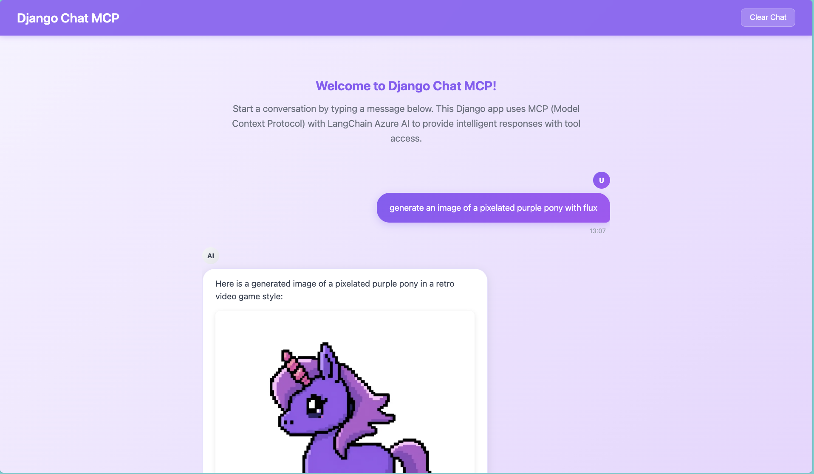

# Django Chat App with MCP Server Integration

A simple Django web application that mimics ChatGPT's interface with a light purple theme. This app uses [LangChain Azure AI](https://github.com/langchain-ai/langchain-azure), but can be updated to use any other model, and MCP (Model Context Protocol) servers to provide intelligent AI responses with enhanced capabilities. The example from my DjangoCon talk uses the [Hugging Face MCP server](https://huggingface.co/settings/mcp). Update the `views.py` file to add your hugingface token. Add an `.env` file or update the `settings.py` file to add your Azure AI credtentials.



## Features

- Beautiful ChatGPT-like interface with light purple theme
- AI-powered responses using gpt-4.1
- **MCP Server Integration**: Enhanced with ability to add any mcp server
- **React Agent**: Uses LangGraph React agent for advanced tool usage
- Real-time chat functionality
- Message history saved to database

## What's New: MCP Integration

This app now integrates with MCP (Model Context Protocol) servers, specifically the Microsoft 365 MCP server. This means the AI can:

- Access Microsoft 365 services and tools
- Provide more contextual and action-oriented responses
- Use specialized tools for various tasks
- Fall back gracefully to standard AI responses if MCP fails

## Setup Instructions

### 1. Prerequisites
- Python 3.8 or higher
- Node.js (for MCP server)
- OpenAI API key OR Azure OpenAI credentials

### 2. Installation

1. **Clone or download this project**
   ```bash
   cd django_mcp
   ```

2. **Activate the virtual environment** (already created)
   ```bash
   source venv/bin/activate
   ```

3. **Install dependencies** (already installed)
   ```bash
   pip install -r requirements.txt
   ```

4. **Configure API Keys**
   - Open the `.env` file in the root directory
   - Configure either OpenAI OR Azure OpenAI credentials:

   **Option A: **Azure AI** (This should also work with Github models for free!) 
   ```
   AZURE_AI_ENDPOINT=https://your-resource.openai.azure.com/
   AZURE_AI_API_KEY=your-azure-api-key-here
   AZURE_AI_API_VERSION=2024-02-15-preview
   AZURE_AI_DEPLOYMENT_NAME=gpt-4
   ```

    **Option B: OpenAI**
   ```
   OPENAI_API_KEY=sk-your-actual-api-key-here
   ```

5. **Run database migrations**
   ```bash
   python manage.py migrate
   ```

6. **Start the development server**
   ```bash
   python manage.py runserver
   ```

### 3. Usage

1. Open your web browser and go to: `http://127.0.0.1:8000/`
2. You'll see a beautiful ChatGPT-like interface
3. Type your message in the input field and press "Send"
4. The AI will respond using:
   - **First**: MCP React agent with any tools you've provided
   - **Fallback**: Direct OpenAI/Azure AI if MCP fails
   - **Demo**: Simple message if no API keys are configured


## Project Structure

```
django_mcp/
├── chatgpt_app/           # Django project settings
├── chat/                  # Chat application
│   ├── models.py         # Database models
│   ├── views.py          # View functions
│   ├── urls.py           # URL routing
│   └── templates/        # HTML templates
├── static/               # Static files
├── venv/                 # Virtual environment
├── .env                  # Environment variables
├── manage.py             # Django management script
└── README.md             # This file
```

## Features Explained

### Frontend
- **Modern UI**: Clean, ChatGPT-inspired interface
- **Light Purple Theme**: Beautiful gradient backgrounds and purple accents
- **Responsive Design**: Works perfectly on both desktop and mobile
- **Smooth Animations**: Hover effects and loading states
- **Real-time Updates**: Messages appear instantly

### Backend
- **Django Framework**: Robust and secure web framework
- **LangChain Integration**: Easy integration with OpenAI
- **Database Storage**: All conversations are saved
- **Error Handling**: Graceful error messages for users
- **Security**: CSRF protection and input validation

## Customization

### Changing the Theme
You can easily customize the purple theme by modifying the CSS variables in `chat/templates/chat/index.html`:

```css
/* Main purple color */
background: linear-gradient(135deg, #8b5cf6 0%, #a855f7 100%);

/* Light purple background */
background: linear-gradient(135deg, #f5f3ff 0%, #e9d5ff 100%);
```

### Using Different AI Models
You can change the AI model in `chat/views.py`:

```python
llm = AzureAIChatCompletionsModel(
     endpoint=azure_endpoint,
     model=model,
     api_version=version,
     credential=azure_api_key
 )
```


## License

This project is for educational purposes. Please respect OpenAI's usage policies when using their API.
